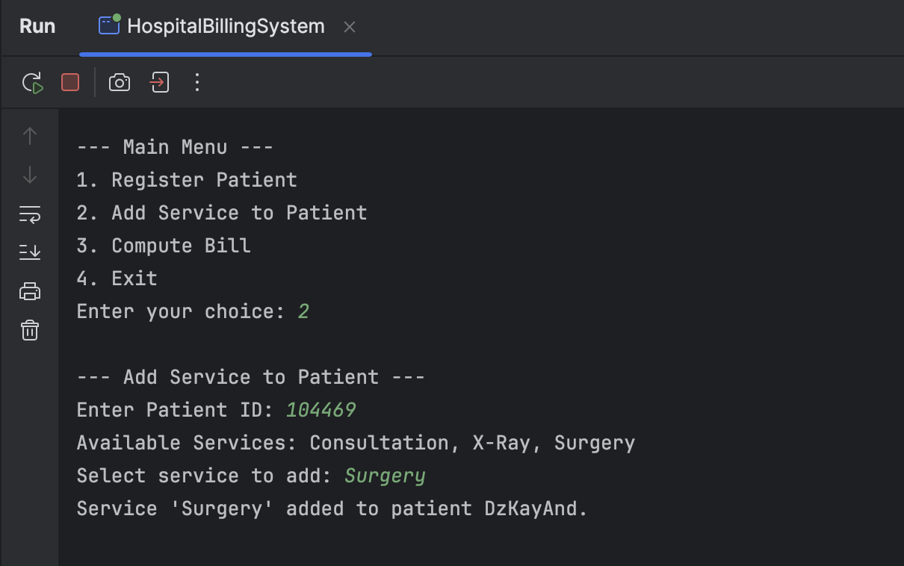

# FECP Java Session2 OOP Design Pattern - Group 14

## Group Information

| Name              | GitHub Username | Role |
|:------------------| :--- | :--- |
| **Kayne Rodrigo** | `kaynerodrigo` | Main Application & Patient Management |
| **Dzelle Tan**    | `dzelletan-gcash` | Service Management & Factory Pattern |
| **Andre Lacra**   | `Andyzxc4` | Billing Computation & Strategy Pattern |

---

## Project Title

**GCash MedCare Billing System**

---

## Project Description

This project is a Java-based console application designed to manage Gcash Medcare billing process. It demonstrates core Object-Oriented Programming (OOP) principles and applies fundamental design patterns to handle patient registration, service management, and flexible billing computations.

The system allows a user to:
* Register new patients.
* Add various medical services (like Consultation, X-Ray, and Surgery) to a patient's record.
* Calculate the final bill by applying different discount strategies based on the payment method (e.g., HMO, Senior Citizen, Cash).

---

## Design Patterns Implemented

This project leverages two key design patterns to ensure a flexible and maintainable codebase.

### Factory Pattern
* **Purpose:** To create objects without exposing the creation logic to the client.
* **Implementation:** The `ServiceFactory` class is used to create different `Service` objects. The main application requests a service by type (e.g., "surgery"), and the factory handles the instantiation, decoupling the main system from the specific service classes.

### Strategy Pattern
* **Purpose:** To define a family of algorithms, encapsulate each one, and make them interchangeable.
* **Implementation:** The `BillingStrategy` interface defines a common method for bill calculation. Concrete classes like `HmoBillingStrategy`, `SeniorBillingStrategy`, and `CashBillingStrategy` implement this interface, each providing a different discount algorithm. The main system selects the appropriate strategy at runtime, allowing billing logic to be changed or added easily.

---

## Project Structure

The project is organized into several classes, each with a distinct responsibility, following OOP principles.

We used packages to group classes by their function:
* **`model/`**: Holds the data blueprints (Patient, Service).
* **`factory/`**: Contains the class responsible for creating objects (ServiceFactory).
* **`strategy/`**: Holds the different billing algorithm classes (HmoBillingStrategy, CashBillingStrategy, etc.).

This separation makes it clear where to look if patient's data structure needs to be changed, how services are created, or how billing is calculated.

### UML Class Diagram

The UML (Unified Modeling Language) class diagram below provides a visual blueprint of the system's architecture. It illustrates the classes, their attributes and methods, and how they are related to one another.
* **Classes**: Each box represents a class, such as `Patient` or `Service`.
* **Relationships**: The lines and arrows show how the classes interact. For instance, the diagram shows that a `HospitalBillingSystem` manages many `Patient` objects and that a `Patient` can receive multiple `Service`s.
* **Design Patterns**: The diagram clearly depicts the **Factory Pattern** through the `ServiceFactory` creating `Service` objects. It also shows the **Strategy Pattern**, with the `BillingStrategy` interface being implemented by concrete strategies like `HmoBillingStrategy` and `CashBillingStrategy`.

This diagram serves as a guide to understanding the project's object-oriented design at a high level.

---

## Screenshot of Output

Register a Patient

Add Services

Compute a Bill

Exit
